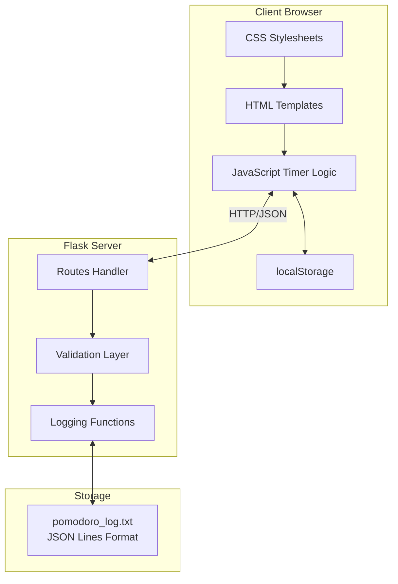
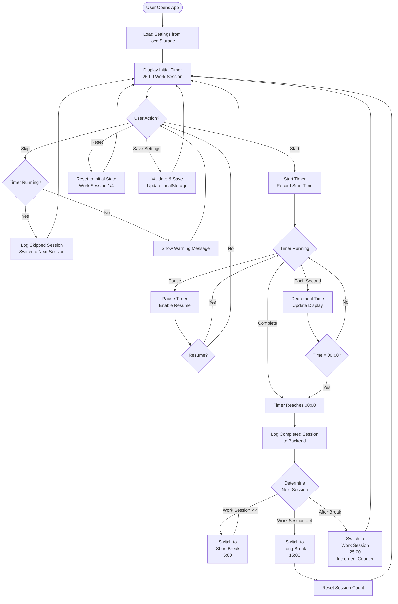
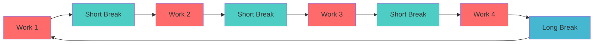
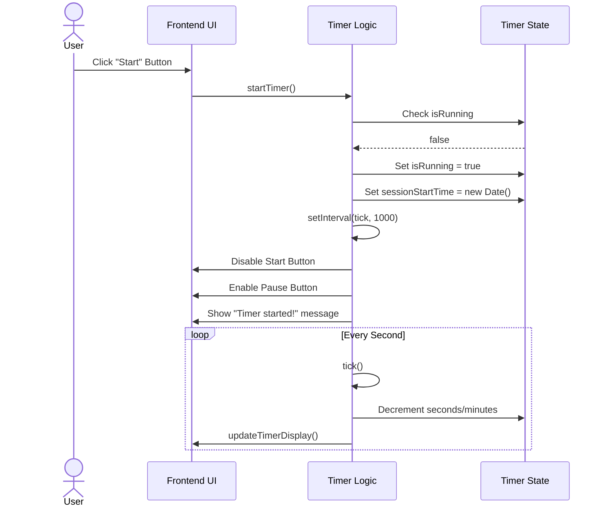
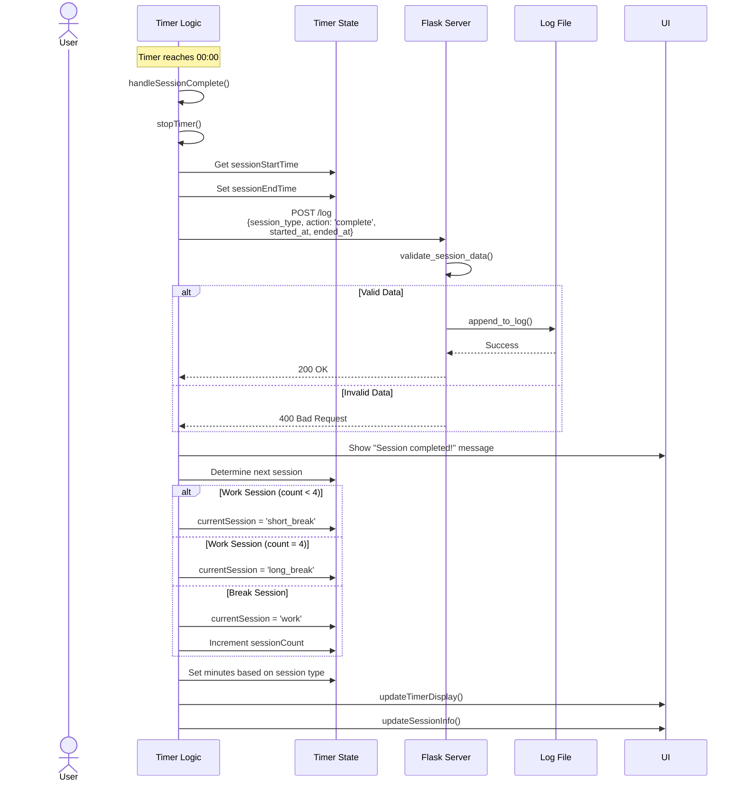
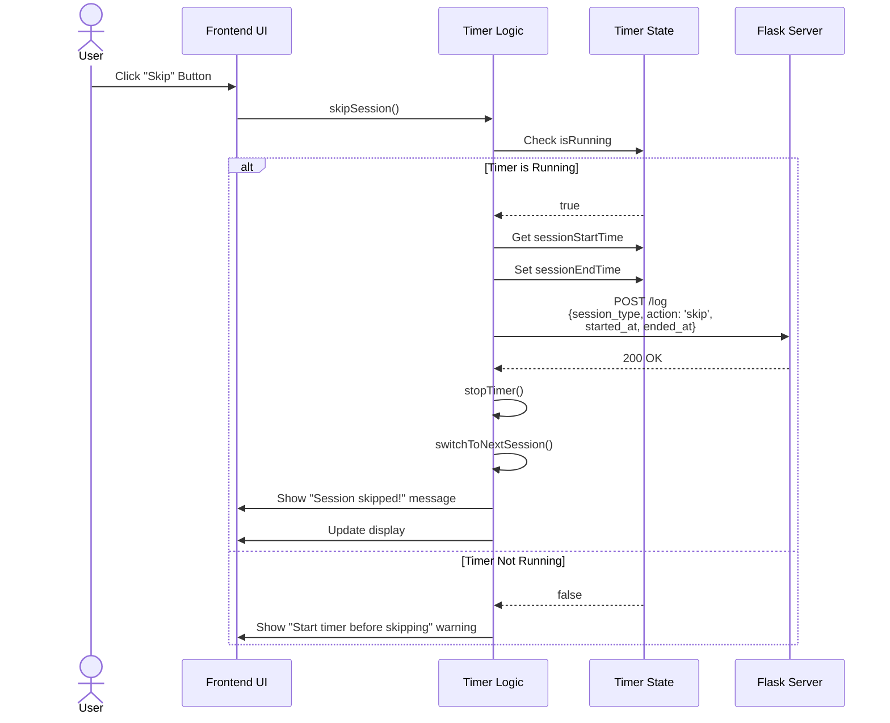
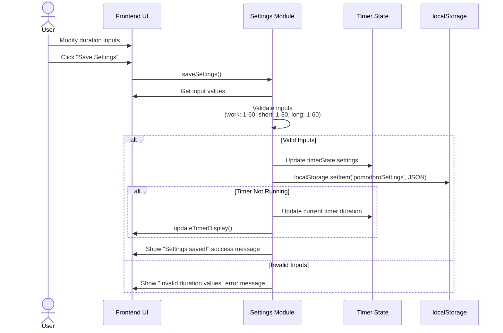
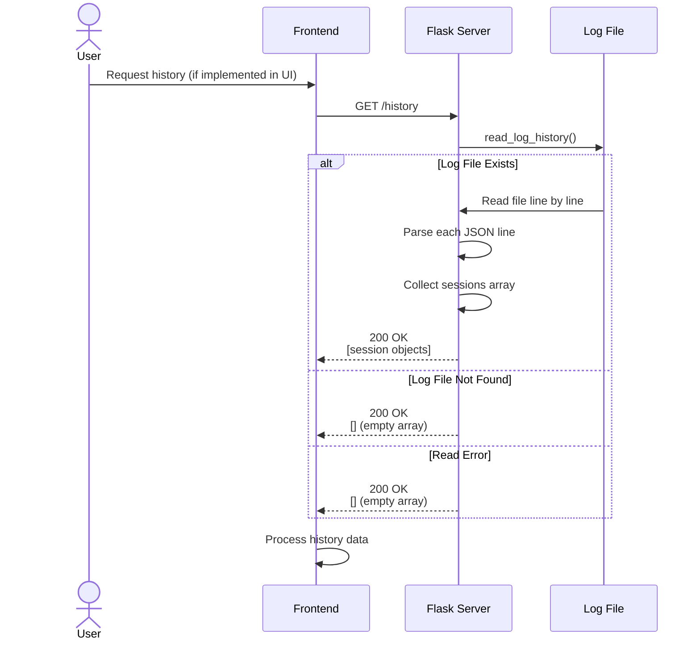
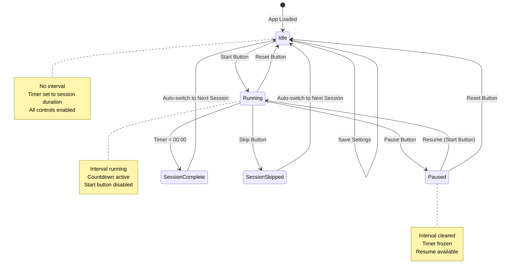
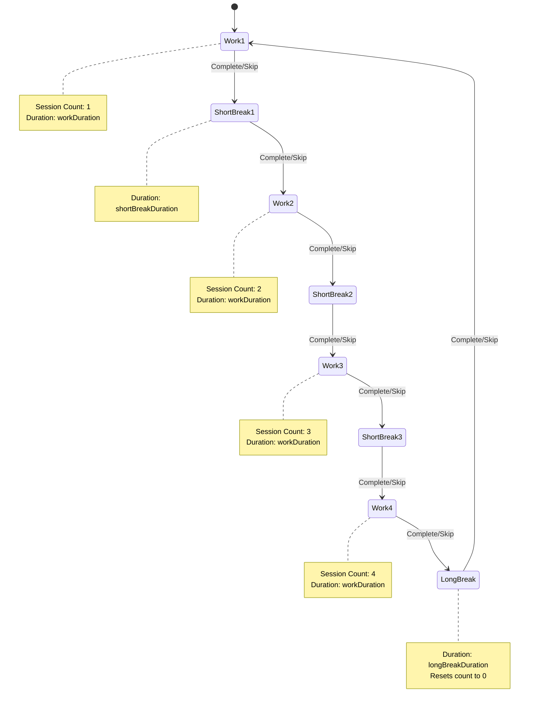

# Pomodoro Timer Application - Technical Documentation

## Table of Contents
- [Overview](#overview)
- [Architecture](#architecture)
- [Application Components](#application-components)
- [User Flow](#user-flow)
- [Sequence Diagrams](#sequence-diagrams)
- [API Endpoints](#api-endpoints)
- [Data Models](#data-models)
- [Frontend State Management](#frontend-state-management)

## Overview

The Pomodoro Timer is a web-based application that helps users improve productivity using the Pomodoro Technique. The application features a customizable timer that cycles through work sessions and breaks, with session logging capabilities.

### Key Features
- **Configurable Timer**: Customize work, short break, and long break durations
- **Session Tracking**: Tracks 4 work sessions before a long break
- **Session Logging**: Records completed and skipped sessions to a backend
- **Persistent Settings**: Saves user preferences in browser localStorage
- **Responsive Controls**: Start, pause, skip, and reset functionality

### Technology Stack
- **Backend**: Flask (Python)
- **Frontend**: Vanilla JavaScript, HTML5, CSS3
- **Storage**: JSON Lines file format for session logs, localStorage for settings

---

## Architecture

The application follows a client-server architecture with a Flask backend serving both the static frontend and REST API endpoints.



### Component Responsibilities

| Component | Responsibility |
|-----------|---------------|
| `app.py` | Flask server, routing, validation, file I/O |
| `timer.js` | Timer logic, state management, API communication |
| `index.html` | UI structure and layout |
| `style.css` | Visual styling and responsive design |
| `pomodoro_log.txt` | Persistent storage for session history |

---

## Application Components

### Backend (Flask)

#### Main Routes

1. **`GET /`** - Serves the main application page
2. **`GET /health`** - Health check endpoint (returns 200 OK)
3. **`POST /log`** - Logs a completed or skipped session
4. **`GET /history`** - Retrieves all logged sessions

#### Core Functions

- **`validate_session_data(data)`**: Validates session data before logging
- **`append_to_log(session_data)`**: Writes session data to log file
- **`read_log_history()`**: Reads and parses all logged sessions

### Frontend (JavaScript)

#### State Management

The application maintains a single `timerState` object:

```javascript
timerState = {
    minutes: 25,              // Current timer minutes
    seconds: 0,               // Current timer seconds
    isRunning: false,         // Timer active flag
    isPaused: false,          // Timer paused flag
    currentSession: 'work',   // Current session type
    sessionCount: 1,          // Work sessions completed (1-4)
    intervalId: null,         // setInterval reference
    sessionStartTime: null,   // ISO timestamp of session start
    settings: {               // User configurable settings
        workDuration: 25,
        shortBreakDuration: 5,
        longBreakDuration: 15
    }
}
```

#### Key Functions

- **Timer Control**: `startTimer()`, `pauseTimer()`, `resumeTimer()`, `stopTimer()`, `resetTimer()`
- **Session Management**: `switchSession()`, `determineNextSession()`, `handleSessionComplete()`
- **Settings**: `loadSettings()`, `saveSettings()`
- **API Communication**: `logSession()`, `fetchHistory()`
- **UI Updates**: `updateTimerDisplay()`, `updateSessionInfo()`, `showStatusMessage()`

---

## User Flow

### Main Application Flow



### Session Cycle Flow



---

## Sequence Diagrams

### Start Timer Sequence



### Complete Session Sequence



### Skip Session Sequence



### Save Settings Sequence



### Fetch History Sequence



---

## API Endpoints

### POST /log

Logs a completed or skipped Pomodoro session.

**Request:**
```json
{
  "session_type": "work | short_break | long_break",
  "action": "complete | skip",
  "started_at": "2025-11-19T10:00:00.000Z",
  "ended_at": "2025-11-19T10:25:00.000Z"
}
```

**Response (Success):**
```json
{
  "success": true,
  "message": "Session logged successfully"
}
```

**Response (Error):**
```json
{
  "error": "Missing required field: session_type"
}
```

**Status Codes:**
- `200` - Success
- `400` - Invalid data
- `500` - Server error

### GET /history

Retrieves all logged sessions.

**Response:**
```json
[
  {
    "session_type": "work",
    "action": "complete",
    "started_at": "2025-11-19T10:00:00.000Z",
    "ended_at": "2025-11-19T10:25:00.000Z"
  },
  {
    "session_type": "short_break",
    "action": "skip",
    "started_at": "2025-11-19T10:25:00.000Z",
    "ended_at": "2025-11-19T10:27:00.000Z"
  }
]
```

**Status Codes:**
- `200` - Success (returns empty array if no history)

### GET /health

Health check endpoint for monitoring.

**Response:**
```json
{
  "status": "healthy"
}
```

**Status Codes:**
- `200` - Service is running

---

## Data Models

### Session Log Entry

Each line in `pomodoro_log.txt` is a JSON object:

```json
{
  "session_type": "work",
  "action": "complete",
  "started_at": "2025-11-19T10:00:00.000Z",
  "ended_at": "2025-11-19T10:25:00.000Z"
}
```

**Field Descriptions:**

| Field | Type | Values | Description |
|-------|------|--------|-------------|
| `session_type` | string | `work`, `short_break`, `long_break` | Type of session |
| `action` | string | `complete`, `skip` | How the session ended |
| `started_at` | string | ISO 8601 timestamp | When the session started |
| `ended_at` | string | ISO 8601 timestamp | When the session ended |

### Settings Object (localStorage)

Stored in browser's localStorage as `pomodoroSettings`:

```json
{
  "workDuration": 25,
  "shortBreakDuration": 5,
  "longBreakDuration": 15
}
```

**Field Constraints:**

| Field | Type | Range | Default |
|-------|------|-------|---------|
| `workDuration` | number | 1-60 minutes | 25 |
| `shortBreakDuration` | number | 1-30 minutes | 5 |
| `longBreakDuration` | number | 1-60 minutes | 15 |

---

## Frontend State Management

### State Transitions



### Session Type State Machine



---

## Running the Application

### Prerequisites
- Python 3.7+
- Flask
- Modern web browser

### Installation

1. Install dependencies:
   ```bash
   pip install -r requirements.txt
   ```

2. Navigate to the app directory:
   ```bash
   cd pomodoro_app
   ```

3. Run the Flask server:
   ```bash
   python app.py
   ```

4. Open browser to:
   ```
   http://127.0.0.1:5000
   ```

### Project Structure

```
pomodoro_app/
├── app.py                 # Flask backend
├── pomodoro_log.txt      # Session logs (auto-generated)
├── static/
│   ├── style.css         # Styling
│   └── timer.js          # Frontend logic
└── templates/
    └── index.html        # Main UI
```

---

## Testing

The application includes comprehensive tests in `tests/test_app.py`:

- Route testing (/, /health, /log, /history)
- Validation testing
- Session logging
- Error handling

Run tests with:
```bash
pytest tests/
```

---

## Future Enhancements

Potential features for future development:

1. **Analytics Dashboard**: Visualize productivity patterns
2. **Sound Notifications**: Audio alerts for session completion
3. **Browser Notifications**: Desktop notifications when timer completes
4. **Statistics View**: Display session history in the UI
5. **Export Data**: Download session logs as CSV/JSON
6. **Dark Mode**: Theme switcher
7. **Multi-user Support**: User accounts and authentication
8. **Task Labels**: Associate sessions with specific tasks
9. **Progress Tracking**: Daily/weekly/monthly statistics
10. **Custom Session Cycles**: Configure number of sessions before long break

---

## License

This project is part of the GitHub Copilot Workshop 2025.

