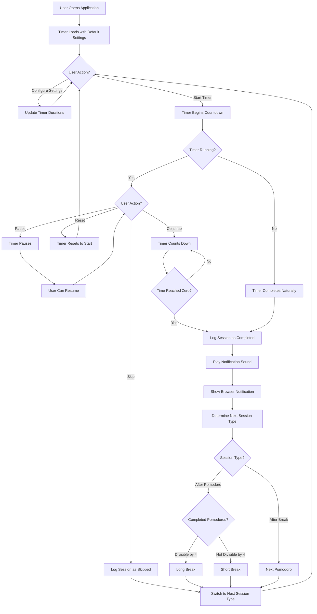
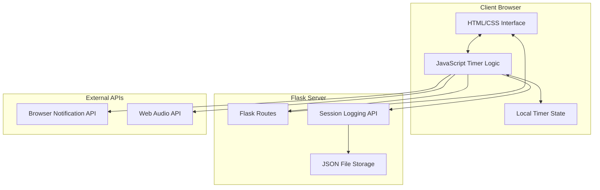
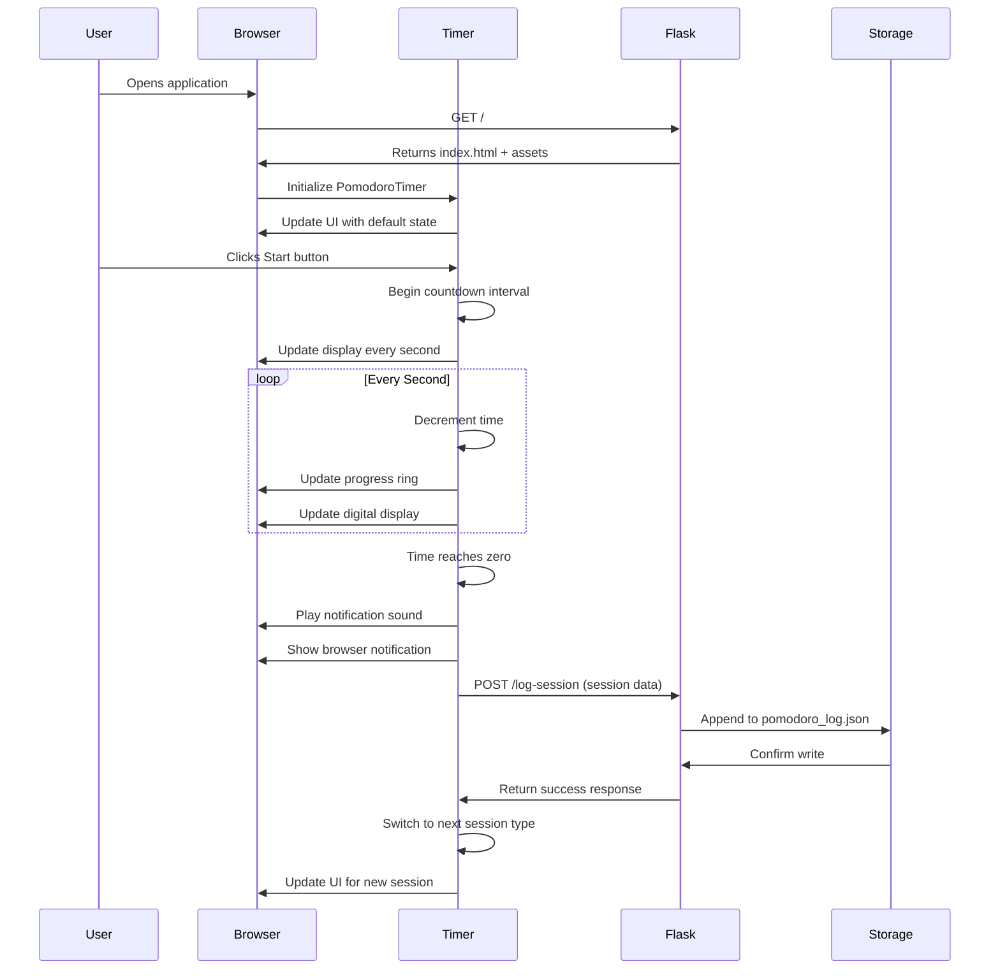
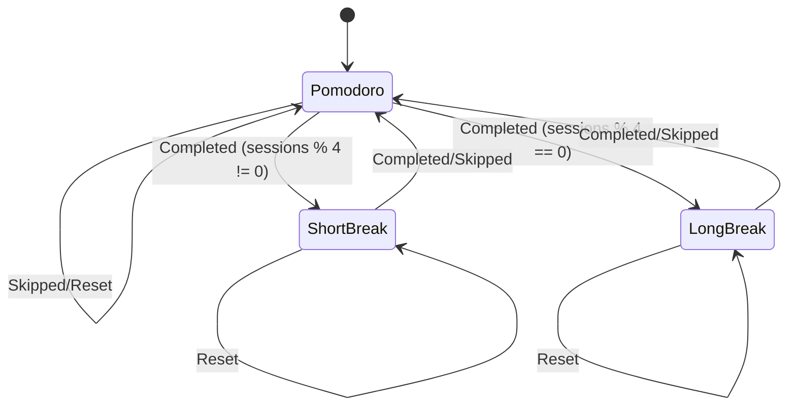

# Pomodoro Timer Web Application Documentation

## Table of Contents
1. [Overview](#overview)
2. [Application Structure](#application-structure)
3. [Core Components](#core-components)
4. [User Flow](#user-flow)
5. [System Architecture](#system-architecture)
6. [API Endpoints](#api-endpoints)
7. [Data Flow](#data-flow)
8. [Session Management](#session-management)
9. [Technical Implementation](#technical-implementation)

## Overview

The Pomodoro Timer Web Application is a full-stack web application built with Flask (Python backend) and vanilla JavaScript (frontend) that implements the Pomodoro Technique for productivity management. The application provides a visual timer with customizable durations, session tracking, and automatic cycle management between work sessions and breaks.

### Key Features
- **Interactive Timer**: Visual countdown with progress ring animation
- **Session Management**: Automatic cycling between Pomodoro sessions, short breaks, and long breaks
- **Customizable Durations**: User-configurable timer lengths for different session types
- **Session Logging**: Automatic tracking of completed, skipped, and paused sessions
- **Visual & Audio Notifications**: Browser notifications and sound alerts when sessions end
- **Responsive Design**: Mobile-friendly interface with modern CSS styling

## Application Structure

```
pomodoro-app/
├── app.py                    # Flask backend server
├── pomodoro_log.json        # Session data storage (auto-generated)
├── templates/
│   └── index.html           # Main application template
├── static/
│   ├── app.js              # Frontend timer logic and UI controls
│   └── style.css           # Application styling and animations
├── requirements.txt         # Python dependencies
└── documentation.md         # This documentation file
```

## Core Components

### 1. Backend (Flask - `app.py`)
- **Web Server**: Serves the main application and static files
- **Session Logging API**: Handles POST requests to log session data
- **Session History API**: Provides GET endpoint for retrieving session history
- **Data Persistence**: Saves session logs to JSON file

### 2. Frontend JavaScript (`static/app.js`)
- **PomodoroTimer Class**: Main timer logic and state management
- **UI Control Handlers**: Event listeners for buttons and settings
- **Timer Engine**: Countdown logic with 1-second intervals
- **Progress Visualization**: SVG progress ring animation
- **Session Cycling**: Automatic transitions between session types
- **Notification System**: Audio and browser notifications

### 3. User Interface (`templates/index.html` + `static/style.css`)
- **Timer Display**: Large digital clock with progress ring
- **Control Panel**: Start/Pause/Reset/Skip buttons
- **Settings Panel**: Duration configuration inputs
- **Status Display**: Current session information and messages
- **Responsive Layout**: Mobile-optimized design

## User Flow



## System Architecture



## API Endpoints

### 1. GET `/` - Main Application
**Purpose**: Serves the main application page
**Response**: HTML template with timer interface
**Status Codes**: 200 (Success)

### 2. POST `/log-session` - Session Logging
**Purpose**: Logs completed, skipped, or paused sessions
**Request Body**:
```json
{
  "session_type": "pomodoro|shortBreak|longBreak",
  "start_time": "2025-11-28T08:00:00.000Z",
  "end_time": "2025-11-28T08:25:00.000Z",
  "status": "completed|skipped|paused",
  "duration_minutes": 25
}
```
**Response**:
```json
{
  "success": true,
  "message": "Session logged successfully"
}
```
**Status Codes**: 
- 200 (Success)
- 400 (Missing required fields)
- 500 (Server error)

### 3. GET `/session-history` - Session History
**Purpose**: Retrieves all logged sessions for analytics
**Response**: Array of session objects
**Status Codes**: 200 (Success), 500 (Server error)

## Data Flow



## Session Management

### Session Types and Flow
1. **Pomodoro Session** (default: 25 minutes)
   - Main work session
   - After completion → Short Break or Long Break
   - Increments completed pomodoro counter

2. **Short Break** (default: 5 minutes)
   - Regular break between pomodoros
   - After completion → Next Pomodoro Session

3. **Long Break** (default: 15 minutes)
   - Extended break every 4 completed pomodoros
   - After completion → Next Pomodoro Session

### Session Cycling Logic


## Technical Implementation

### Timer Engine
The timer uses JavaScript's `setInterval()` with 1-second precision:
```javascript
this.timerInterval = setInterval(() => {
    this.tick();
}, 1000);
```

### Progress Ring Animation
SVG circle with dynamic `stroke-dashoffset` calculation:
```javascript
const circumference = 2 * Math.PI * 140;
const progress = (this.totalTime - this.timeLeft) / this.totalTime;
const offset = circumference - (progress * circumference);
this.progressRing.style.strokeDashoffset = offset;
```

### Session Data Persistence
JSON file structure for session logging:
```json
[
  {
    "session_type": "pomodoro",
    "start_time": "2025-11-28T08:00:00.000Z",
    "end_time": "2025-11-28T08:25:00.000Z",
    "status": "completed",
    "duration_minutes": 25
  }
]
```

### Responsive Design
CSS Grid and Flexbox layout with mobile breakpoints:
```css
@media (max-width: 600px) {
    .timer-text { font-size: 2.5rem; }
    .btn { min-width: 80px; }
}
```

### Browser Compatibility
- **Notifications**: Web Notifications API with permission handling
- **Audio**: Web Audio API with fallback error handling
- **Local Storage**: Session state maintained in memory only
- **Modern Browsers**: ES6+ features (classes, async/await, arrow functions)

### Performance Considerations
- **Timer Precision**: 1-second intervals balance accuracy and performance
- **DOM Updates**: Minimal DOM manipulation per tick
- **Memory Management**: Proper cleanup of intervals and event listeners
- **Network Efficiency**: Session logging only on completion/skip events

### Security Features
- **Input Validation**: Server-side validation of session data
- **Error Handling**: Graceful degradation for API failures
- **XSS Protection**: Template escaping in Flask/Jinja2
- **CORS**: Same-origin policy enforcement

---

*This documentation provides a comprehensive overview of the Pomodoro Timer Web Application. For technical questions or feature requests, please refer to the source code or create an issue in the project repository.*